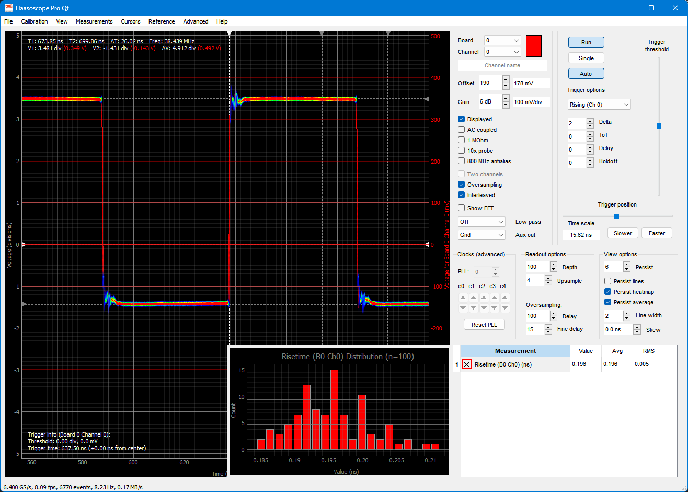

## Haasoscope Pro

An affordable 2 GHz 3.2 GS/s 12 bit open-source open-hardware expandable USB oscilloscope

## Links

Available on [CrowdSupply](https://www.crowdsupply.com/andy-haas/haasoscope-pro) and at [Mouser](https://www.mouser.com/c/?q=Haasoscope)

[Hackaday.io page](https://hackaday.io/project/200773-haasoscope-pro)

[Schematics PDF](adc%20board/haasoscope_pro_adc_fpga_board_schematics.pdf)

[Routing image](adc%20board/haasoscope_pro_adc_fpga_board_routing.png)

[Firmware overview](adc%20board%20firmware/schematic.pdf)

[Software overview](software/diagram.png)

## Video tutorials

See this [YouTube Playlist](https://www.youtube.com/playlist?list=PLB1iz3MRh5DiKQQmUUNoTf2oo_m5qS00k) !

## Software and firmware versions

- "main" branch currently has v31 firmware which adds fan PWM control and more software features
- "v31_test" branch: new development is occuring here
- old: "v30" branch has v30 firmware which adds trigger delay and holdoff options and more software features
- old: "v29_cleanup" branch has a beta version of the software with yet more features
- old: "v29" branch has v29 firmware and adds more software features
- old: "v27" branch has v27 firmware that shipped with the first round of units

To use a different branch, do <code>git pull && git checkout "branchname"</code>.
For v30+ you can [download a release](https://github.com/drandyhaas/HaasoscopePro/releases) zip file for your platform (Windows, Mac, Linux).
Then run the new software, update the firmware (if needed) on your board from that new software, and power cycle the board (automatic firmware reload for boards with v29+ firmware).

## Quick start for Windows / Mac (M1+ chip) / Linux

1) [Download a release](https://github.com/drandyhaas/HaasoscopePro/releases) zip file for your OS
2) Install [FTDI D2xx driver](https://ftdichip.com/drivers/d2xx-drivers/) for your OS:
- for Windows: run the setup exe at <code>ftdi_setup.exe</code>
- for Mac: <code>sudo mkdir -p /usr/local/lib; sudo cp libftd2xx.dylib /usr/local/lib/</code> 
- for Linux: <code>sudo cp libftd2xx.so /usr/lib/</code>
3) Plug Haasoscope Pro into your computer via USB (5V 2A at least!)
4) Run **HaasoscopeProQt** in the <code>(OS)_HaasoscopeProQt</code> directory

## Fuller way of running

1) Install python3 and git for your operating system
2) Get code: <code>git clone https://github.com/drandyhaas/HaasoscopePro.git</code>
3) <code>cd HaasoscopePro/software</code>
4) Install dependencies: <code>pip install -r requirements.txt</code> 
   or manually: <code>pip install numpy scipy pyqtgraph PyQt5 pyftdi ftd2xx requests packaging</code> 
5) Install FTDI driver (see Quick start above)
6) Plug Haasoscope Pro into your computer via USB (5V 2A at least!)
7) Run: <code>python3 HaasoscopeProQt.py</code>

## Tips

- If not enough power is being supplied, plug in via a [powered USB hub](https://a.co/d/hfAtVhl), a [USB PD hub with 15W reserved for ports](https://a.co/d/174I3v8), or use an external [5-24V 20W+ power adapter with 2.1mm plug](https://a.co/d/1EkzLRP)
- If you get security issues on Mac, do: <code>xattr -cr Mac_HaasoscopeProQt</code>
- If the board is not found on Linux, use this udev rule and then plug it in: <code>sudo cp ft245.rules /etc/udev/rules.d/</code>
- If you get an error like "qt.qpa.plugin: Could not load the Qt platform plugin "xcb" in "" even though it was found", try: <code>sudo apt install libxcb-xinerama0</code>

## Repository structure

- [adc board](adc%20board/): Design files and documentation for the main board, based on Eagle 9.6.2
- [adc board firmware](adc%20board%20firmware/): Quartus lite project and documentation for the Altera Cyclone IV FPGA firmware
- [case](case/): Front and back PCB panels for the aluminum case
- [other](other/): Other files like safety docs, jlc files, and ftdi template
- [software](software/): Python files and documentation for the oscilloscope program
- [sub boards](sub%20boards/): Eagle design files and documentation for smaller test boards that were used during development

## 2 GHz Active Probe

All designs for the accompanying Haasoscope Pro-be active probe are in a [separate repository](https://github.com/drandyhaas/oshw-active-probe)

## Other GUIs

 - [ngscopeclient](https://www.ngscopeclient.org/) is a very powerful multi-instrument analysis suite. HaasoscopeProQt must be running, which then automatically opens the LAN port and accepts connections from ngscopeclient. See the ngscopeclient user manual for details.
