# HaasoscopePro Software

Python-based oscilloscope software for the HaasoscopePro hardware.

## Quick Start

### Installation

```bash
# Install dependencies from requirements file
pip install -r requirements.txt

# Or install manually
pip install numpy scipy pyqtgraph PyQt5 ftd2xx requests packaging
```

**Note:** `requests` and `packaging` are optional but recommended for automatic update checking.

### Running with Hardware

```bash
# Run the application
python HaasoscopeProQt.py
```

The software will automatically detect connected HaasoscopePro boards via USB.

### Running with Dummy Server (No Hardware Required)

For development and testing without physical hardware:

```bash
# Terminal 1 - Start dummy server
cd dummy_scope
python dummy_server.py --port 9999

# Terminal 2 - Run application with socket connection
python HaasoscopeProQt.py --socket localhost:9999
```

**Command-Line Options:**

```bash
# Single dummy board on custom port
python HaasoscopeProQt.py --socket localhost:9999

# Multiple dummy boards (multi-board simulation)
python HaasoscopeProQt.py --socket localhost:9998 --socket localhost:9999 --socket localhost:10000

# Remote dummy server
python HaasoscopeProQt.py --socket 192.168.1.100:9999

# Mix hardware and dummy boards (if hardware is detected, socket boards are added)
python HaasoscopeProQt.py --socket localhost:9999

# Limit maximum number of devices to connect (default: 100)
python HaasoscopeProQt.py --max-devices 4

# Testing mode (disables dynamic status bar updates for stable screenshots)
python HaasoscopeProQt.py --socket localhost:9999 --testing

# Combine options
python HaasoscopeProQt.py --max-devices 5 --socket localhost:9999 --testing

# Show help
python HaasoscopeProQt.py --help
```

**Automatic Fallback:** If no `--socket` is specified and no hardware is detected, the application automatically tries to connect to `localhost:9998`.

See [dummy_scope/README.md](dummy_scope/README.md) for detailed dummy server documentation.

## Code Architecture

This diagram shows the software architecture with all major components, data flows, and relationships.

```mermaid
graph TD
    %% --- Styling Definitions ---
    classDef core fill:#d9ead3,stroke:#38761d,stroke-width:2px,font-size:12px;
    classDef startup fill:#cfe2f3,stroke:#3d85c6,stroke-width:2px,font-size:12px;
    classDef hardware fill:#fce5cd,stroke:#e69138,stroke-width:2px,font-size:12px;
    classDef helpers fill:#fff2cc,stroke:#f1c232,stroke-width:2px,font-size:12px;
    classDef datastore fill:#e2d0f3,stroke:#674ea7,stroke-width:2px,font-size:12px;
    classDef user fill:#f4cccc,stroke:#cc0000,stroke-width:2px,font-size:12px;
    classDef device fill:#d0e0e3,stroke:#45818e,stroke-width:2px,font-size:14px;
    classDef testing fill:#c9daf8,stroke:#1c4587,stroke-width:2px,font-size:12px,stroke-dasharray:5;

    %% --- Entry Point ---
    User(["👤 User Input<br>Clicks, Menus, Keys"]) -.-> A
    A["🚀 HaasoscopeProQt.py<br><i>Entry Point</i>"] --> B

    %% --- Main Controller ---
    B["🎛️ MainWindow<br>main_window.py<br><i>Central Controller</i>"]

    %% --- Central State ---
    C[("💾 ScopeState<br>scope_state.py<br>Settings & Config")]

    B <--> C

    %% --- Core Processing Components ---
    B --> D["🔌 HardwareController<br>hardware_controller.py<br>USB/Socket Communication"]
    B --> E["⚙️ DataProcessor<br>data_processor.py<br>Signal Processing"]
    B --> F["📊 PlotManager<br>plot_manager.py<br>Visualization"]

    D <--> C
    E <--> C
    F <--> C

    %% --- Owned Managers ---
    B --> M1["📏 MeasurementsManager<br>measurements_manager.py<br>Statistics & Analysis"]
    B --> M2["📌 ReferenceManager<br>reference_manager.py<br>Waveform Storage"]
    B --> M3["💾 SettingsManager<br>settings_manager.py<br>Save/Load .hsp"]

    M1 --> C
    M2 --> C
    M3 --> C

    %% --- Plot Manager Owned Components ---
    F --> P1["🎯 CursorManager<br>cursor_manager.py<br>H/V Cursors"]

    P1 --> C

    %% --- Popup Windows ---
    B -.-> W1["📈 FFTWindow<br>FFTWindow.py<br>Frequency Analysis"]
    B -.-> W2["🧮 MathChannelsWindow<br>math_channels_window.py<br>Channel Math"]
    B -.-> W3["📊 HistogramWindow<br>histogram_window.py<br>Distribution View"]
    B -.-> W4["🕐 HistoryWindow<br>history_window.py<br>Waveform History"]

    W1 --> C
    W2 --> C

    %% --- Data Flow ---
    D -- "Raw ADC Data" --> E
    E -- "Processed xydata" --> F
    E -- "Measurements" --> M1
    E -- "FFT Data" --> W1

    %% --- Hardware Layer ---
    D --> H1["🔧 Low-Level Libs<br>usbs.py, board.py<br>USB_FT232H.py"]
    H1 --> H2["🔌 Hardware Interface<br>SPI: spi.py, adf435x_core.py<br>Calibration: calibration.py"]

    H1 --> DEV1["🖥️ Physical Scope<br>via USB/FTDI"]
    H1 --> DEV2["🔬 Dummy Server<br>dummy_scope/<br>TCP Socket"]

    %% --- Additional Services ---
    B -.-> S1["🌐 SCPIsocket.py<br>Remote Control"]
    B -.-> S2["💾 DataRecorder<br>data_recorder.py<br>CSV Export"]

    %% --- Style Applications ---
    class A startup
    class B core
    class C datastore
    class D,E,F core
    class M1,M2,M3,P1 core
    class W1,W2,W3,W4 helpers
    class H1,H2 hardware
    class DEV1 device
    class DEV2 testing
    class S1,S2 helpers
    class User user
```



## Key Modules

### Core Components

**`main_window.py`** - Main application controller
- Handles all UI events (clicks, menus, keyboard shortcuts)
- Orchestrates data flow between hardware, processing, and display
- Manages all component lifecycles
- Implements per-channel/per-board setting synchronization

**`scope_state.py`** - Central state storage
- Single source of truth for all oscilloscope settings
- Per-channel settings: gain, offset, AC/DC, impedance, resamp, peak detect, persistence
- Per-board settings: trigger settings, channel modes, pulse stabilizer
- Global settings: timebase, downsample, display options

**`hardware_controller.py`** - Hardware abstraction layer
- Manages communication with oscilloscope boards
- Sends low-level commands (SPI, trigger, gain/offset)
- Retrieves waveform data packets
- Supports both USB (FTDI) and socket (dummy server) connections

**`data_processor.py`** - Signal processing
- Processes raw ADC data into calibrated waveforms
- Calculates FFT spectra
- Computes measurements (Vpp, RMS, frequency, duty cycle, rise time)
- Applies calibration corrections

**`plot_manager.py`** - Display and visualization
- Renders waveforms using PyQtGraph
- Manages per-channel peak lines, persistence, references
- Handles XY plot mode
- Cursor and measurement overlays
- Real-time plot updates

### Supporting Components

**`FFTWindow.py`** - FFT spectrum analyzer window
- Real-time frequency domain display
- Per-channel FFT enable/disable
- Peak detection and analysis

**`math_channels_window.py`** - Math channel operations
- Channel arithmetic (add, subtract, multiply, divide)
- Mathematical functions (differentiate, integrate, smooth, envelope, abs, square, sqrt, log, exp)
- Digital filters (low-pass, high-pass, band-pass, band-stop) with Butterworth and Chebyshev designs
- Time shift with sub-sample interpolation (0.001 Hz to 10 GHz range)
- AC coupling and min/max tracking
- Custom expression evaluation

**Implementation Note**: Math channels are calculated from non-resampled source data (before `doresamp` is applied) to ensure correct FFT frequency ranges and optimal filter performance. Results are then resampled for display to match the source channel's resampling setting. This ensures that:
- FFT analysis shows the true Nyquist frequency of the source data
- Digital filters operate at the actual hardware sample rate
- Min/Max tracking automatically handles array size changes when `doresamp` is modified

**`measurements_manager.py`** - Measurements display
- Automated measurement calculations
- Statistics table display
- Rise time and edge analysis

**`reference_manager.py`** - Reference waveform management
- Store and recall waveforms
- Per-channel reference display
- Waveform comparison

**`cursor_manager.py`** - Cursor controls
- Horizontal/vertical cursors
- Delta measurements
- Snap to waveform
- Rise time fit visualization

**`settings_manager.py`** - Settings persistence
- Save/load configuration files (.hsp)
- Backward compatibility handling
- Per-channel/board settings migration

**`data_recorder.py`** - Data logging
- CSV export
- Event capture
- Waveform recording

### Hardware Communication

**`usbs.py`** - USB device management
- FTDI device discovery and initialization
- Socket device connections (for dummy server)
- Multi-board detection and ordering

**`board.py`** - Low-level board commands
- SPI communication
- PLL configuration
- Fan control, temperature reading
- Clock distribution for multi-board setups

**`USB_FT232H.py`** - FTDI wrapper
- Synchronous FIFO mode (FT232H)
- High-speed USB data transfer

**`dummy_scope/`** - Testing framework
- TCP socket-based oscilloscope simulator
- Configurable waveform generation (sine, square, pulse)
- Full protocol implementation
- Multi-board simulation support

### Utility Modules

**`calibration.py`** - Calibration data management

**`histogram_window.py`** - Histogram display

**`history_window.py`** - Waveform history viewer

**`SCPIsocket.py`** - SCPI remote control interface

**`spi.py`** - SPI communication helpers

**`utils.py`** - Common utility functions

## Data Flow

1. **Acquisition**: `hardware_controller.get_event()` retrieves raw ADC data from board
2. **Processing**: `data_processor.process_board_data()` converts to calibrated waveforms
3. **Display**: `plot_manager.update_plots()` renders waveforms on screen
4. **Analysis**: `data_processor.calculate_measurements()` computes measurements
5. **FFT**: Optional FFT analysis in `FFTWindow`

## Configuration Files

Settings are saved in `.hsp` files (JSON format):
- Window geometry and UI state
- Per-channel settings (gain, offset, colors, persistence, resamp)
- Per-board settings (trigger, modes, pulse stabilizer)
- Display preferences (grid, cursors, markers)
- Math channel definitions
- Reference waveforms

**Backward Compatibility**: The settings manager automatically converts old single-value settings (resamp, peak detect, pulse stabilizer) to per-channel/board arrays when loading legacy files.

## Development

### Building Standalone Executables

```bash
# Windows
windowspyinstaller.bat

# macOS
./macpyinstaller.sh

# Linux
./linuxpyinstaller.sh
```

Executables are created in `dist/` directory.

### Adding New Per-Channel Settings

1. Add array to `scope_state.py`:
   ```python
   self.my_setting = [default_value] * (num_boards * num_chan_per_board)
   ```

2. Update GUI in `main_window.py` `select_channel()`:
   ```python
   self.ui.mySettingBox.setValue(s.my_setting[s.activexychannel])
   ```

3. Add change handler:
   ```python
   def my_setting_changed(self, value):
       self.state.my_setting[self.state.activexychannel] = value
   ```

4. Update `settings_manager.py` for save/load with backward compatibility

### Adding New Per-Board Settings

Same pattern as per-channel, but use `s.activeboard` instead of `s.activexychannel`.

### Code Style

- Follow existing naming conventions (snake_case for functions, CamelCase for classes)
- Document complex algorithms with inline comments
- Use type hints where helpful
- Keep UI logic in `main_window.py`, processing in separate modules

## Testing

### Unit Tests
Currently testing is primarily manual. The dummy server enables automated testing scenarios.

### Integration Testing with Dummy Server
```python
# Start dummy server programmatically
from dummy_scope.dummy_server import DummyOscilloscopeServer
server = DummyOscilloscopeServer(port=9999)
server.start()

# Connect and test
# ... your test code ...

server.stop()
```

### Multi-Board Testing
Run multiple dummy servers on different ports to test multi-board synchronization:
```bash
python dummy_scope/dummy_server.py --port 9998 &
python dummy_scope/dummy_server.py --port 9999 &
python dummy_scope/dummy_server.py --port 10000 &
python HaasoscopeProQt.py --socket localhost:9998 localhost:9999 localhost:10000
```

## Troubleshooting

**ImportError: No module named 'PyQt5'**
```bash
pip3 install PyQt5 pyqtgraph
```

**FTDI device not found**
- Install FTDI D2XX drivers (see main README)
- Check USB connection (5V 2A minimum)
- Verify device appears in system device manager

**Slow performance**
- Reduce persistence time
- Disable peak detect when not needed
- Lower screen refresh rate in settings
- Close FFT window when not in use

**Settings not saving**
- Check file permissions in application directory
- Ensure `.hsp` file is not read-only
- Try "Save As" to different location

## Dependencies

All dependencies are listed in `requirements.txt` and can be installed with:

```bash
pip install -r requirements.txt
```

### Core Dependencies
- **Python 3.7+** (3.8+ recommended)
- **PyQt5** - GUI framework
- **pyqtgraph** - Fast plotting library
- **numpy** - Numerical computing
- **scipy** - Signal processing (FFT, filtering, interpolation)
- **ftd2xx** - FTDI driver wrapper for hardware communication

### Optional Dependencies
- **requests** - For automatic update checking (gracefully degrades if not installed)
- **packaging** - For version comparison in update checker

### Testing Dependencies (optional)
- **pytest** - Testing framework
- **pyautogui** - GUI automation for testing
- **Pillow** - Image processing for screenshot comparison

## License

Same as parent HaasoscopePro project.

## See Also

- [Main Project README](../README.md)
- [Dummy Server Documentation](dummy_scope/README.md)
- [Firmware Documentation](../adc%20board%20firmware/README.md)
- [Hardware Schematics](../adc%20board/haasoscope_pro_adc_fpga_board_schematics.pdf)
- [HaasoscopePro on Hackaday.io](https://hackaday.io/project/200773-haasoscope-pro)
